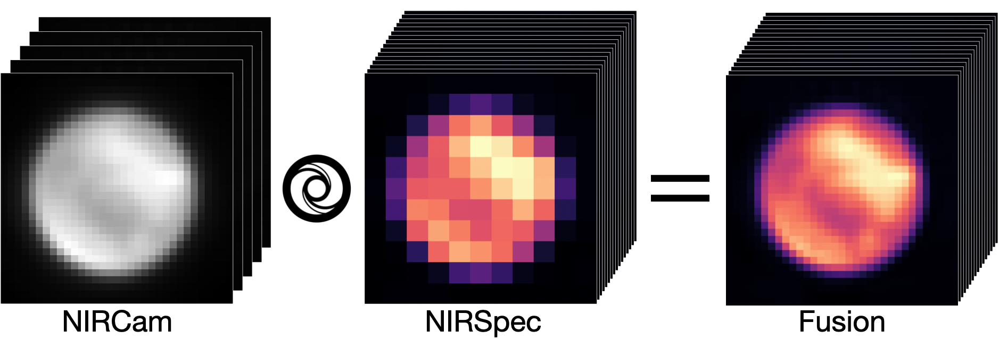

# Fusion of JWST data: Demonstrating practical feasibility

> Landry Marquis, Claire Guilloteau, Thomas Oberlin, Nicolas Dobigeon, Oliver Berné

This is the official implementation of the SyFu algorithm from the paper [Fusion of JWST data: Demonstrating practical feasibility](https://doi.org/10.1051/0004-6361/202558121). If you use this code, please cite the paper.



## Abstract

> Data fusion is a computational process widely used in Earth observation to generate high-resolution hyperspectral data cubes with two spatial and one spectral dimensions. It merges data from instruments with complementary characteristics: one with low spatial but high spectral resolutions, and another with high spatial but low spectral resolutions. In astronomy, the use of such instrumental combinations is becoming increasingly common, making data fusion a promising approach for enhancing observational data. Until now, however, its application to astronomical data has remained unsuccessful. We present the first successful astronomical data fusion using JWST integral field spectroscopy with NIRSpec and imaging across 29 filters with NIRCam. Applied to observations of the d203-506 protoplanetary disk in Orion and of Titan, our method produces fused hyperspectral cubes with NIRCam spatial and NIRSpec spectral resolutions. These results pave the way for extracting the physical properties from JWST data with unprecedented spatial resolution and showcase the transformative potential of data fusion in astronomy.

## Environment

This code has been made using python 3.11.5.
To set up the SyFu environment, please run:

```console
conda env create -f SyFu.yml
conda activate SyFu
```

## Downloading the data

Before launching the code you must download the NIRCam and NIRSpec data from [MAST](https://mast.stsci.edu/portal/Mashup/Clients/Mast/Portal.html). To replicate the results of the paper, please use the following Proposal IDs:

- d203-506 data: 1288
- Titan data: 1251

## Running the SyFu algorithm

The code can then be launched following two steps:
1. in `Configurations`, please modify the parameters ```NIRCam_path``` and ```NIRSpec_path``` of the three configuration files following the location of your downloaded data,
2. run SyFu:

```console
python main_fusion.py
```

**Important remark:** *This code uses the [STPSF library](https://stpsf.readthedocs.io/en/latest/index.html) to generate the point spread functions (PSF) of the instruments, which takes several hours to complete while the rest of the code computes in less than a minute. You can avoid this generation process by downloading the PSF [here]() and setting the ```compute_NIRCam_psf``` and ```compute_NIRSpec_psf``` flags to ```False``` for all three configurations.*

## To cite this paper

```
@article{marquis2026fusion,
  title={Fusion of JWST data: Demonstrating practical feasibility},
  author={Marquis, Landry and Guilloteau, Claire and Oberlin, Thomas and Dobigeon, Nicolas and Bern{\'e}, Olivier},
  journal={Astronomy \& Astrophysics},
  volume={708},
  pages={L3},
  DOI={10.1051/0004-6361/202558121},
  year={2026},
  publisher={EDP Sciences}
}
```
